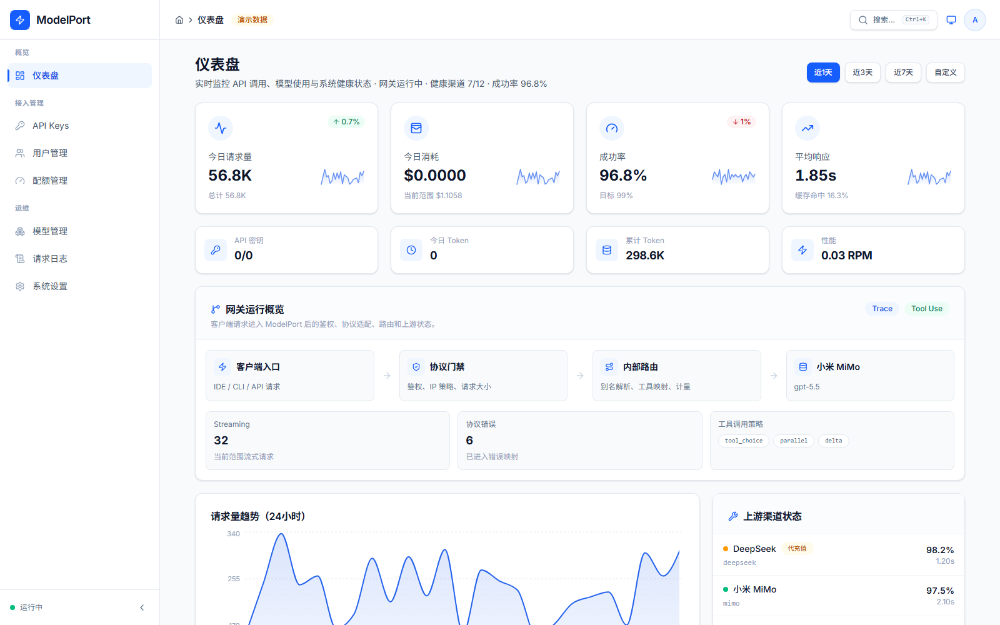
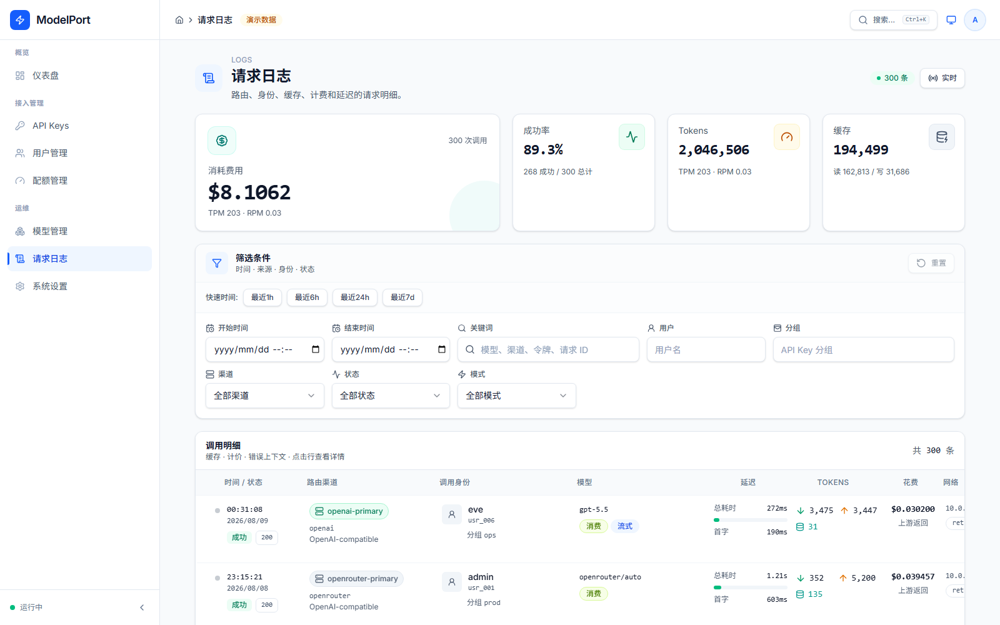
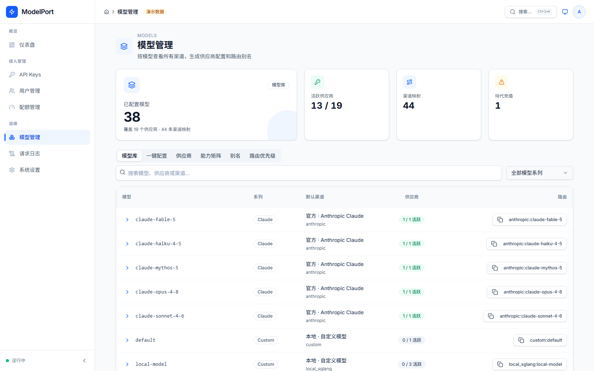
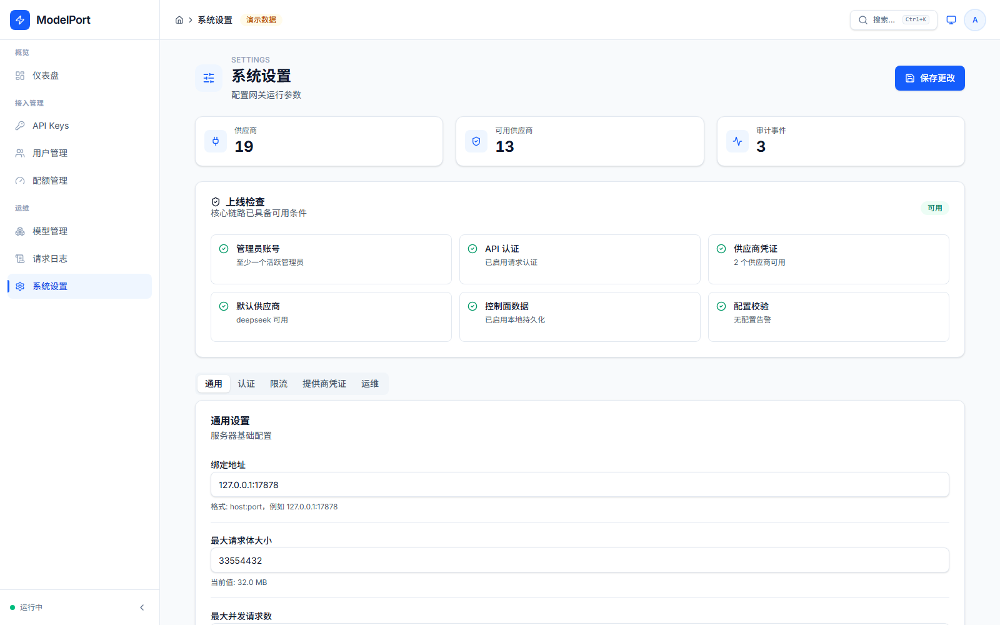

# ModelPort

**A local, Anthropic-compatible model gateway for Claude Code and VS Code Claude.**

[](https://github.com/xueying24100-source/ModelPort/actions/workflows/ci.yml)
[](./LICENSE)

[English](#modelport) · [中文说明](#modelport-中文说明)

ModelPort sits between your local Claude Code / VS Code Claude client and one or
more model providers. It speaks the Anthropic `/v1/messages` protocol on the
client side, translates to the upstream provider's protocol (Anthropic-compatible
or OpenAI-compatible), and gives you a small React control panel for API keys,
users, quotas, provider routing and request logs — without sending your traffic
through anyone else's cloud.

It is a personal project built to solve a concrete problem: switch Claude Code
between DeepSeek, other OpenAI-compatible providers, and local runtimes, without
juggling client configs or losing visibility into usage and cost.

## Screenshots

| Dashboard | Request logs |
|---|---|
|  |  |

| Models | Settings |
|---|---|
|  |  |

*(Screenshots above are captured in the dashboard's built-in demo/mock mode — no
real accounts or upstream traffic involved.)*

## Why

- **One stable entry point.** Claude Code / VS Code Claude always talks to
  `ANTHROPIC_BASE_URL=http://127.0.0.1:17878`. Switching model or provider is a
  config/alias change on the gateway, not a client reconfiguration.
- **Protocol translation, not just proxying.** Requests are adapted between the
  Anthropic Messages protocol and OpenAI-compatible chat completions, including
  streaming (SSE), tool-use / function calling, and `max_tokens` field
  differences across providers.
- **A real control plane**, not just a reverse proxy: per-user API keys, teams
  and quotas, provider credential pools (multiple upstream accounts per
  provider with manual / failover / round-robin selection, health and cooldown
  tracking), request logs, and usage/cost dashboards.
- **Local-first.** Keys and traffic stay on your machine or your own network by
  default; state can be stored as local JSON files or in PostgreSQL.

## Architecture

```text
VS Code Claude / Claude Code
        |
        | Anthropic-compatible /v1/messages
        v
┌───────────────────────────────────────────────────────────┐
│                    ModelPort (Rust / axum)                │
│                                                             │
│  auth & CSRF · rate limiting · request validation          │
│  provider routing, aliasing, fallback                       │
│  protocol adapters: Anthropic <-> OpenAI-compatible         │
│  SSE stream translation · tool-use argument handling        │
│  usage/cost accounting · Prometheus-style /metrics          │
│                                                             │
│  Control plane: users, API keys, teams, quotas,             │
│  provider credential pools, request/audit log               │
└───────────────────────────────────────────────────────────┘
        |
        | Anthropic-compatible or OpenAI-compatible
        v
DeepSeek (official) / OpenAI-compatible providers / local runtimes (Ollama, etc.)
```

A React dashboard (`dashboard/`) talks to the same gateway process to manage
API keys, users, quotas, providers, and to browse request logs and usage.

## Tech stack

- **Gateway**: Rust, [axum](https://github.com/tokio-rs/axum), tokio, reqwest,
  tower-http (request-id, tracing). Optional PostgreSQL storage via the
  `postgres` crate, falling back to local JSON files when unset.
- **Dashboard**: React 19, TypeScript, Vite, Zustand, TanStack Query, Tailwind
  CSS v4, Radix UI, Recharts.
- **Deployment**: systemd unit for bare-metal, Docker Compose + optional Caddy
  reverse proxy for containerized/LAN setups.

## Quick start (local, no Docker)

Requires Rust (stable) and Node.js 20+.

```bash
git clone https://github.com/xueying24100-source/ModelPort.git
cd ModelPort

cp .env.example .env
# edit .env: set MODELPORT_AUTH_TOKEN, MODELPORT_ADMIN_PASSWORD,
# DEEPSEEK_ANTHROPIC_AUTH_TOKEN (or another provider), etc.

scripts/dev.sh          # cargo run, loads .env, foreground
# or: scripts/start.sh  # builds a release binary and runs it in the background
scripts/status.sh
scripts/stop.sh
```

Point Claude Code / VS Code Claude at the gateway using the `ANTHROPIC_*`
variables already set in `.env` (`ANTHROPIC_BASE_URL=http://127.0.0.1:17878`).

Run the dashboard separately in dev mode:

```bash
cd dashboard
npm install
npm run dev
```

By default the dashboard ships with `VITE_MODELPORT_MOCK` / `VITE_DEMO` mode
(see `dashboard/.env.local`) so it can be previewed with no backend running.
Unset those to point it at a live gateway via `VITE_API_BASE_URL`.

## Container deployment templates

`deploy/docker/` contains the pieces used for a containerized/LAN deployment:

- `modelport.env.example` — env vars for the gateway, dashboard and optional
  PostgreSQL storage.
- `dashboard.nginx.conf` — nginx config for serving the built dashboard.
- `Caddyfile.example` — optional reverse proxy for LAN or HTTPS setups.

This snapshot does not include a `Dockerfile` / `docker-compose.yml` — bring
your own build files (a Rust builder stage for `model-port` + a static stage
serving `dashboard/dist` behind the nginx config above works well) or run the
gateway directly as described in Quick start. `deploy/systemd/` includes a
hardened systemd unit for bare-metal deployments instead.

## CLI

The `model-port` binary also doubles as a small CLI:

```bash
model-port config validate        # validate env-based configuration
model-port backup export <path>   # export auth + control-plane state
model-port backup validate <path>
model-port backup restore <path> --yes
```

## Project layout

```text
src/                Rust gateway (axum). routes.rs is the HTTP entry point;
                    providers/ holds Anthropic / OpenAI-compatible adapters;
                    auth.rs, control.rs cover the control plane; storage.rs
                    is the JSON-file / PostgreSQL persistence layer.
dashboard/          React admin dashboard (Vite + TypeScript).
deploy/             systemd unit + Docker Compose / Caddy deployment templates.
scripts/            dev/start/stop/status, config validation, doctor, smoke
                    tests, provider matrix and release build helpers.
docs/               Public documentation and screenshots.
```

## Status

This is an actively-evolving personal project, not a hosted product. Providers
are only claimed as verified once they've been run against a real upstream key
with `scripts/provider-matrix.sh` — see the provider notes for current status
before relying on a given provider in production.

## Contributing / Security

- Issues and pull requests are welcome — see [`.github/PULL_REQUEST_TEMPLATE.md`](.github/PULL_REQUEST_TEMPLATE.md).
- Please do not paste real API keys, full `.env` files, or unredacted request
  logs into issues or PRs.
- For vulnerability reports, see [`SECURITY.md`](SECURITY.md).

## License

[MIT](./LICENSE)

---

# ModelPort（中文说明）

**面向 Claude Code / VS Code Claude 的本机 Anthropic 兼容模型网关。**

ModelPort 运行在本机（或你自己的内网），介于 Claude Code / VS Code Claude 客户端
和一个或多个模型 provider 之间：对客户端始终暴露标准的 Anthropic
`/v1/messages` 协议，对上游按 provider 类型转换为 Anthropic-compatible 或
OpenAI-compatible 协议；同时提供一个轻量的 React 控制台，管理 API Key、用户、
额度、provider 路由和请求日志——流量不经过任何第三方云端。

这是一个为解决具体问题而做的个人项目：让 Claude Code 能在 DeepSeek、其他
OpenAI-compatible provider 和本地运行时之间自由切换，而不需要来回改客户端配置，
也不会丢失用量和费用的可见性。

## 为什么做这个

- **稳定的单一入口**：Claude Code / VS Code Claude 始终只连
  `ANTHROPIC_BASE_URL=http://127.0.0.1:17878`；切换模型或 provider 只是网关侧的
  配置/别名变更，客户端无需改动。
- **协议转换，而不只是转发**：请求在 Anthropic Messages 协议与
  OpenAI-compatible chat completions 之间做适配，包括流式输出（SSE）、工具调用
  （tool use / function calling）、以及不同 provider 之间 `max_tokens`
  字段的差异处理。
- **真正的控制面**，不是简单反向代理：按用户签发的 API Key、团队与额度、
  provider 凭据账号池（同一 provider 可配置多个上游账号，支持手动/故障切换/
  轮询选择账号,并记录账号健康与冷却状态）、请求日志、用量与费用看板。
- **本地优先**：默认情况下密钥和流量只停留在本机或自己的网络内；状态可以存成
  本地 JSON 文件,也可以存到 PostgreSQL。

## 架构

```text
VS Code Claude / Claude Code
        |
        | Anthropic-compatible /v1/messages
        v
┌───────────────────────────────────────────────────────────┐
│                 ModelPort（Rust / axum）                    │
│                                                             │
│  鉴权与 CSRF · 限流 · 请求校验                                │
│  provider 路由、别名解析、故障切换                             │
│  协议适配：Anthropic <-> OpenAI-compatible                   │
│  SSE 流式转换 · 工具调用参数处理                               │
│  用量/费用统计 · Prometheus 风格 /metrics                      │
│                                                             │
│  控制面：用户、API Key、团队、额度、                            │
│  provider 凭据账号池、请求/审计日志                            │
└───────────────────────────────────────────────────────────┘
        |
        | Anthropic-compatible 或 OpenAI-compatible
        v
DeepSeek 官方 / OpenAI-compatible provider / 本地运行时（Ollama 等）
```

React 管理后台（`dashboard/`）连接同一个网关进程，用来管理 API Key、用户、
额度、provider,以及查看请求日志和用量。

## 技术栈

- **网关**：Rust、[axum](https://github.com/tokio-rs/axum)、tokio、reqwest、
  tower-http（request-id、tracing）。可选 PostgreSQL 存储（`postgres` crate），
  未配置时自动回退到本地 JSON 文件。
- **管理后台**：React 19、TypeScript、Vite、Zustand、TanStack Query、
  Tailwind CSS v4、Radix UI、Recharts。
- **部署**：裸机场景用 systemd unit；容器/内网场景用 Docker Compose，可选
  Caddy 反向代理。

## 快速开始（本机,不使用 Docker）

需要 Rust（stable）和 Node.js 20+。

```bash
git clone https://github.com/xueying24100-source/ModelPort.git
cd ModelPort

cp .env.example .env
# 编辑 .env：设置 MODELPORT_AUTH_TOKEN、MODELPORT_ADMIN_PASSWORD、
# DEEPSEEK_ANTHROPIC_AUTH_TOKEN（或其他 provider）等

scripts/dev.sh          # cargo run，加载 .env，前台运行
# 或者：scripts/start.sh  # 编译 release 二进制并后台运行
scripts/status.sh
scripts/stop.sh
```

把 Claude Code / VS Code Claude 指向网关：使用 `.env` 里已经设置好的
`ANTHROPIC_*` 变量（`ANTHROPIC_BASE_URL=http://127.0.0.1:17878`）。

单独以开发模式运行管理后台：

```bash
cd dashboard
npm install
npm run dev
```

管理后台默认开启 `VITE_MODELPORT_MOCK` / `VITE_DEMO` 演示模式
（见 `dashboard/.env.local`），无需启动后端即可预览；如需连接真实后端，删掉这
两个变量并按需设置 `VITE_API_BASE_URL`。

## 容器部署模板

`deploy/docker/` 目前包含容器化/内网部署所需的素材：

- `modelport.env.example` —— 网关、管理后台和可选 PostgreSQL 存储的环境变量。
- `dashboard.nginx.conf` —— 用于托管构建产物的 nginx 配置。
- `Caddyfile.example` —— 可选的 LAN/HTTPS 反向代理配置。

这份快照里没有包含 `Dockerfile` / `docker-compose.yml`——可以自行补充构建文件
（一个编译 `model-port` 的 Rust 构建阶段 + 一个按上面 nginx 配置托管
`dashboard/dist` 的静态阶段即可），或者直接按"快速开始"里的方式本机运行。
裸机部署可以用 `deploy/systemd/` 里已经加固过的 systemd unit。

## CLI

`model-port` 二进制同时也是一个轻量 CLI：

```bash
model-port config validate        # 校验基于环境变量的配置
model-port backup export <path>   # 导出鉴权 + 控制面状态
model-port backup validate <path>
model-port backup restore <path> --yes
```

## 目录结构

```text
src/                Rust 网关（axum）。routes.rs 是 HTTP 入口；providers/ 是
                    Anthropic / OpenAI-compatible 协议适配；auth.rs、control.rs
                    是控制面；storage.rs 是 JSON 文件 / PostgreSQL 持久化层。
dashboard/          React 管理后台（Vite + TypeScript）。
deploy/             systemd unit + Docker Compose / Caddy 部署模板。
scripts/            dev/start/stop/status、配置校验、自检、冒烟测试、
                    provider 矩阵和 release 构建脚本。
docs/               公开文档与截图。
```

## 当前状态

这是一个持续迭代中的个人项目,不是托管产品。某个 provider 只有在用真实上游
key 通过 `scripts/provider-matrix.sh` 实测跑通之后才会被标记为"已验证";
在生产环境依赖某个 provider 前,请先确认它的实测状态。

## 贡献 / 安全

- 欢迎提 Issue 和 PR，参见 [`.github/PULL_REQUEST_TEMPLATE.md`](.github/PULL_REQUEST_TEMPLATE.md)。
- 请不要在 Issue / PR 中粘贴真实 API key、完整 `.env` 文件或未脱敏的请求日志。
- 安全问题请参见 [`SECURITY.md`](SECURITY.md)。

## 许可证

[MIT](./LICENSE)
